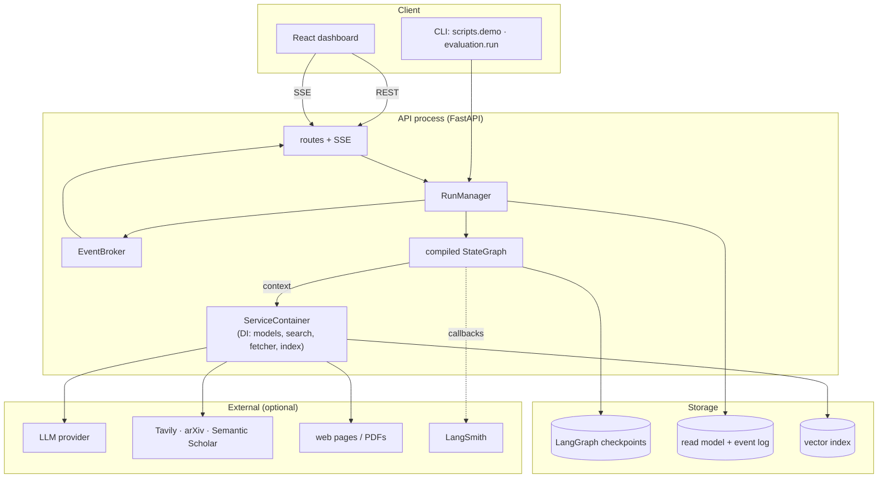
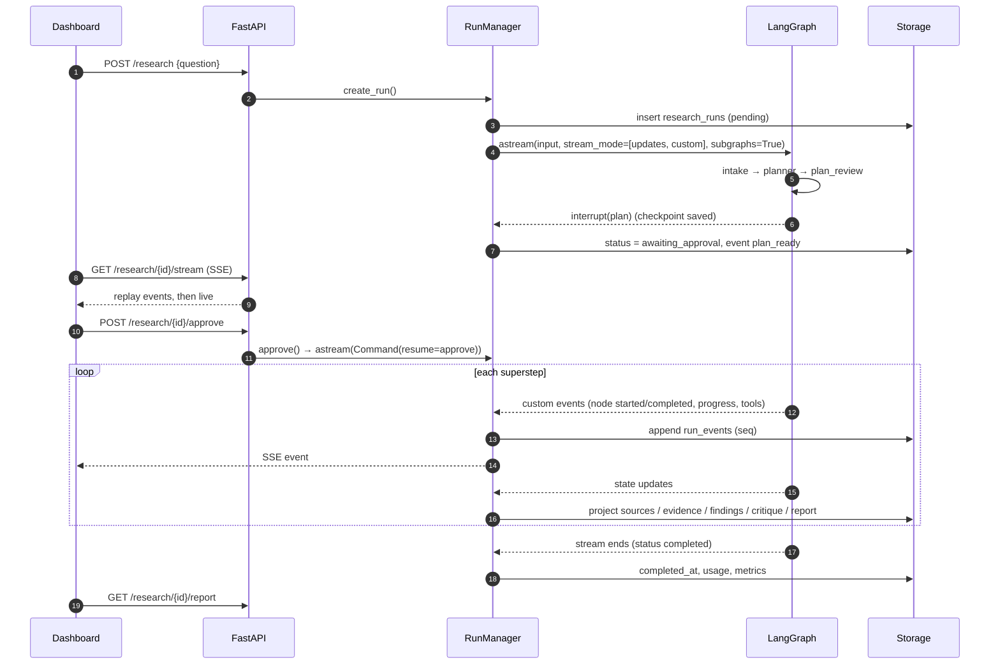
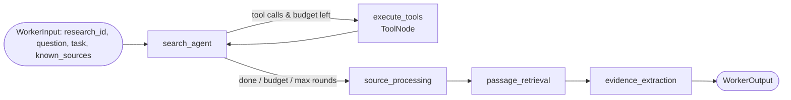
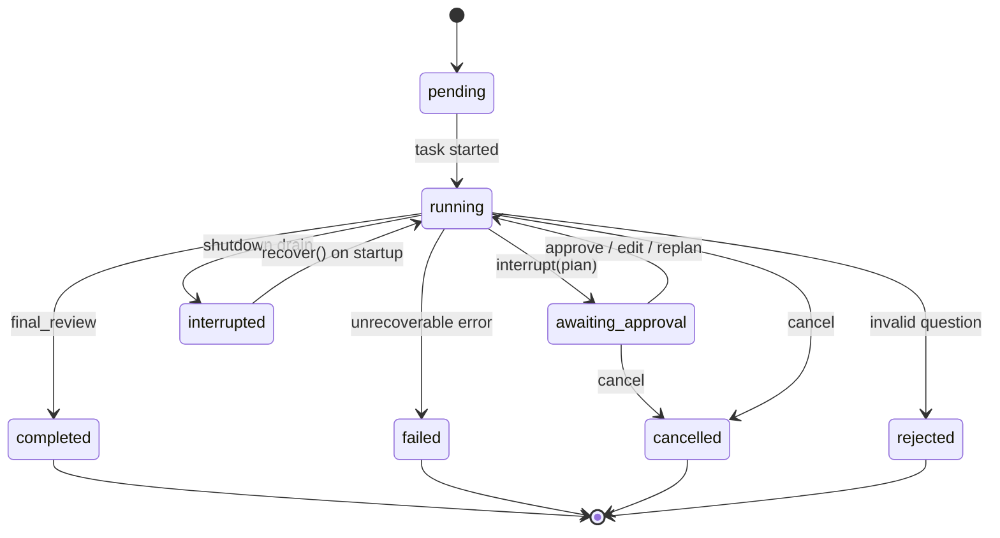
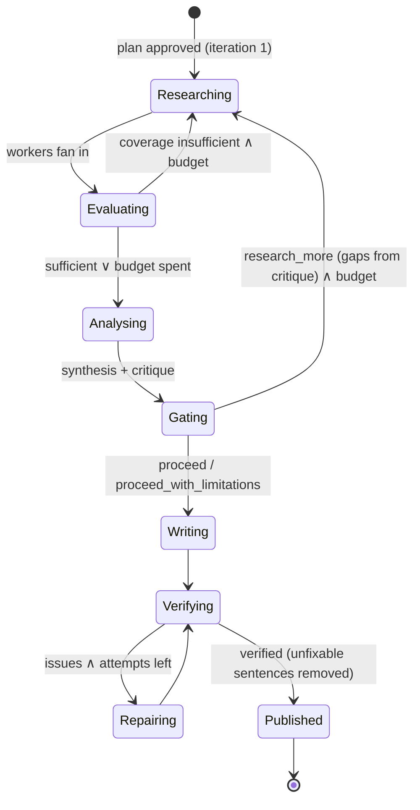
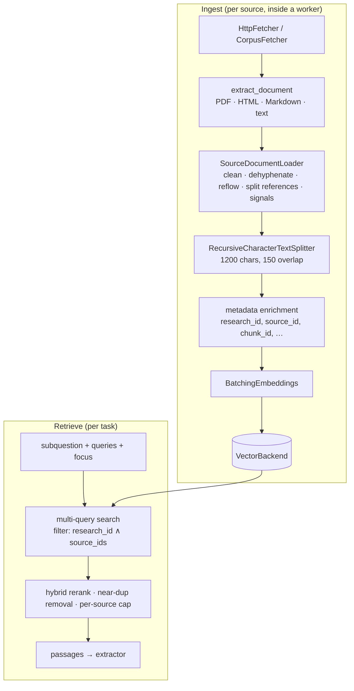
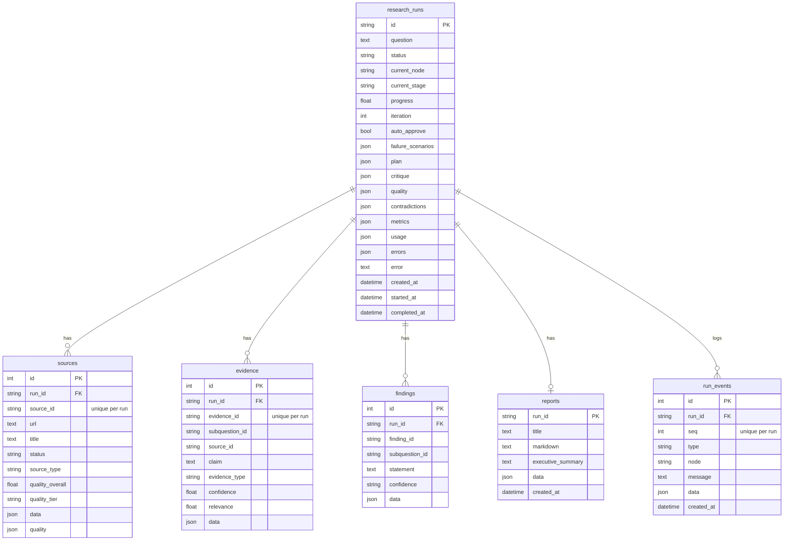

# ResearchGraph — Architecture

This document describes how ResearchGraph is built and why the pieces fit together the way they do. For the
reasoning behind individual choices see [design-decisions.md](design-decisions.md).

- [1. Component architecture](#1-component-architecture)
- [2. Data flow of a research run](#2-data-flow-of-a-research-run)
- [3. Graph design](#3-graph-design)
- [4. State and state transitions](#4-state-and-state-transitions)
- [5. Agents and prompts](#5-agents-and-prompts)
- [6. Retrieval architecture](#6-retrieval-architecture)
- [7. Persistence and database schema](#7-persistence-and-database-schema)
- [8. API architecture](#8-api-architecture)
- [9. Frontend architecture](#9-frontend-architecture)
- [10. Failure handling](#10-failure-handling)
- [11. Observability](#11-observability)
- [12. Scalability considerations](#12-scalability-considerations)

---

## 1. Component architecture

| Component | Responsibility | Key types |
|---|---|---|
| `api` | HTTP + SSE, validation, auth, error mapping | `routes.py`, `sse.py`, `deps.py` |
| `runtime.manager.RunManager` | Starts/resumes/cancels runs as asyncio tasks; consumes the graph stream; projects state; drains on shutdown; recovers on startup | `_ActiveRun`, `_RunView` |
| `runtime.events.EventBroker` | In-process fan-out of live events to SSE subscribers | |
| `runtime.container.ServiceContainer` | Builds long-lived clients once; produces a per-run `ResearchContext` | |
| `graph` | `StateGraph` definition, nodes, routing, reducers, instrumentation, serde | `ResearchState`, `WorkerState` |
| `agents` | LLM roles: prompt templates + structured output + validation + fallbacks | `PlannerOutput`, `CriticOutput`, … |
| `services` | Deterministic domain logic | `score_source`, `assess_quality`, `verify_citations` |
| `retrieval` | Loader, cleaning, chunking, embeddings, vector backends, rerank | `EvidenceIndex` |
| `tools` | Search providers, safe fetcher, parsers, LLM tools | `SearchService`, `HttpFetcher` |
| `llm` | Provider factory, structured-output helper, usage tracking, mock model | `ModelRegistry`, `invoke_structured` |
| `database` | ORM read model, repository, checkpointer factory | `ResearchRepository` |

**Dependency injection.** Nodes receive their dependencies through LangGraph's `context_schema`
(`ResearchContext`: settings, models, search, fetcher, index, fault injector) via the `runtime: Runtime[...]`
parameter. The context is *not* part of the state and is never checkpointed — after a restart a fresh context is
built and the run continues from its persisted state. Tests and the demo construct the same graph with mock/offline
dependencies; nothing in the graph knows which implementation it is talking to.

## 2. Data flow of a research run

Inside the run the information flows **question → plan → tasks → search results → sources → chunks → passages →
evidence → (scores, coverage) → contradictions → findings → critique → quality decision → draft → verified draft →
final report**. Each arrow is a typed model; nothing downstream consumes raw model text.

## 3. Graph design

### 3.1 Main graph

The compiled graph (exported by `graph.get_graph(xray=1).draw_mermaid()`, see [graph.mmd](graph.mmd)) has 14
top-level nodes plus the worker subgraph. Mapping to the logical steps of the specification:

| Logical step | Implementation |
|---|---|
| intake | `intake` |
| planner | `planner` |
| human approval | `plan_review` (`interrupt()` + `Command(goto=…)`) |
| query generation | `query_generation` |
| parallel research / worker architecture | `dispatch_research` → `Send("research_worker", …)` × N |
| web research | worker: `search_agent` ⇄ `execute_tools` (`ToolNode`) |
| source processing | worker: `source_processing` (+ `passage_retrieval`) |
| evidence extraction | worker: `evidence_extraction` |
| source evaluation | `source_evaluation` (also the evidence gate's input) |
| contradiction detection | `contradiction_detection` |
| synthesis | `synthesis` |
| critic | `critic` |
| quality gate | `quality_gate` + `route_after_quality_gate` |
| report writer | `report_writer` |
| citation verification / repair | `citation_verification` ⇄ `citation_repair` |
| final review | `final_review` |

### 3.2 Worker subgraph

- `StateGraph(WorkerState, input_schema=WorkerInput, output_schema=WorkerOutput)` — the parent only ever sees
  `sources, evidence, tool_calls_used, search_history, errors, node_metrics`.
- `search_agent` binds `[web_search, academic_search, calculator]` to the fast model and enforces the budget by
  truncating tool calls (and the matching provider content blocks) before `ToolNode` executes them. With
  `RESEARCH_AGENT_MODE=deterministic` the same node emits the planned searches as tool calls without an LLM.
- `source_processing` ranks candidates (provider score, type authority prior, lexical relevance), keeps a
  **diversity slot** for an under-represented source type, fetches up to `MAX_SOURCES_PER_TASK` concurrently
  (semaphore = 4), parses, cleans, chunks and indexes them; known sources from earlier rounds are reused, not
  re-fetched.
- `passage_retrieval` performs multi-query, source-scoped retrieval with hybrid reranking.
- `evidence_extraction` makes one structured call over the selected passages and verifies every quote.

### 3.3 Budgets and termination

| Budget | Where enforced |
|---|---|
| `MAX_RESEARCH_ITERATIONS` | `query_generation` increments `iteration`; `within_budget()` in both loop routers |
| `MAX_TOOL_CALLS` | `query_generation` allocates `min(queries + 1 + max_sources, remaining // tasks)` per task; workers count searches and fetches; routers reserve 3 calls |
| per-worker search rounds | `search_agent` (`MAX_SEARCH_ROUNDS_PER_TASK`) |
| citation repairs | `route_after_citation_check` (`MAX_CITATION_REPAIR_ATTEMPTS`) |
| node time | `@instrumented(timeout_s=…)` on worker nodes; per-call LLM timeouts |
| graph steps | `recursion_limit` in the run config |

When a budget is exhausted the workflow *proceeds with limitations* — it never loops forever and never fails just
because evidence was thin.

## 4. State and state transitions

### 4.1 Channels and reducers

| Field | Reducer | Written by |
|---|---|---|
| `sources` | `merge_sources` — union by content-addressed ID; prefer processed; union subquestion links | workers |
| `evidence`, `source_quality` | `merge_by_id` | workers / `source_evaluation` |
| `tool_calls_used` | `operator.add` | `search_agent`, `source_processing` |
| `search_history` | `append_unique` | `query_generation`, `search_agent` |
| `errors`, `node_metrics`, `critique_history`, `quality_history` | `operator.add` | any node |
| everything else | last writer wins | exactly one node |

All reducers are commutative and idempotent where parallel writers exist, so the order in which parallel workers
finish does not change the merged state.

### 4.2 Run lifecycle

On resume, LangGraph re-executes the interrupted node from its first line, with `interrupt()` now returning the
reviewer's decision. `plan_review` therefore does nothing with side effects before `interrupt()`, which makes the
re-execution safe; the event log shows it as two `node_started` events around the approval and one
`node_completed`.

### 4.3 Research-loop transitions

## 5. Agents and prompts

| Agent | Tier | Output schema | Fallback when the model fails |
|---|---|---|---|
| planner | strong | `PlannerOutput` | deterministic heuristic plan (comparison-aware) |
| query writer | fast | `QueryGenerationOutput` (batched for all targets) | planned / gap-suggested queries |
| research agent | fast | tool calls | planned queries as deterministic tool calls |
| extractor | fast | `EvidenceExtractionOutput` | no evidence from that worker (recorded error) |
| contradiction judge | fast | `ContradictionOutput` (candidate pairs only) | no contradictions (recorded error) |
| synthesizer | strong | `SynthesisOutput` | top evidence per subquestion as low-confidence findings |
| critic | strong | `CriticOutput` | rule-based critique only |
| writer | strong | `ReportDraftOutput` | report assembled from findings |

Prompts are `ChatPromptTemplate`s. Structured context is passed as JSON inside named blocks
(`<passages>`, `<evidence>`, `<findings>`, …); retrieved content is declared untrusted. Calls go through
`invoke_structured`, which uses `with_structured_output(schema, include_raw=True)` with the configured method
(native JSON schema for Anthropic/OpenAI, the integration default elsewhere) plus Pydantic validation, wraps each attempt in a timeout and bounded exponential backoff, and on a validation failure re-prompts
with the error (bounded). Model output is then validated *again* against state: unknown evidence IDs are dropped,
findings without evidence are discarded, unverifiable quotes are rejected.

**Mock model.** `MockChatModel` subclasses `BaseChatModel` and implements `bind_tools`, so the real
`with_structured_output → PydanticToolsParser` path runs, including validation failures. A `DemoResponder` reads the
same context blocks a real model sees and produces grounded, extractive output.

## 6. Retrieval architecture

| Backend | When | Notes |
|---|---|---|
| `InMemoryBackend` (`InMemoryVectorStore`) | SQLite / demo / tests | callable filter on metadata; released at run end |
| `PGVectorBackend` (`PGVectorStore`) | PostgreSQL | table `researchgraph_chunks` with `research_id`, `source_id`, `chunk_index` columns; engine via `PGEngine.from_engine` on the caller's loop; cosine distance converted to similarity |

Cleaning details that matter in practice: section headings (Abstract, Methods, References, …) always start a new
block (PDFs lose blank lines); hyphenated line breaks are joined unless the hyphenated form appears elsewhere in the
document ("long-context" stays, "accu-racy" becomes "accuracy"); boilerplate lines (cookie banners, newsletter
prompts) are dropped; the references section is split off and counted as a quality signal.

## 7. Persistence and database schema

Two stores with different jobs:

1. **LangGraph checkpoints** (`AsyncPostgresSaver` / `AsyncSqliteSaver`) — complete workflow state per superstep,
   keyed by `thread_id = research_id`. Strict, allowlisted deserialisation.
2. **Read model** — query-friendly tables for the API and UI, maintained by projection:

Projection rules: the `RunManager` keeps a local view of each run's state and applies every `updates` chunk with
the **same reducers** as the graph. Inside worker subgraphs only idempotent keys (`sources`, `evidence`) are applied
early so the UI fills in live; counters and logs arrive once with the worker's output. Upserts use
`INSERT … ON CONFLICT DO UPDATE` (PostgreSQL and SQLite dialects). All timestamps are stored and returned as
timezone-aware UTC (`UTCDateTime` type decorator — SQLite has no native timezone support).

## 8. API architecture

- FastAPI app factory (`create_app`) with a lifespan that opens all services (`open_services`) and closes them
  gracefully — which drains running graphs to a checkpoint.
- Pydantic request/response models (`schemas/api.py`); domain exceptions map to 404/409/400/500 with stable error
  codes; request bodies are capped at 256 KB; list endpoints are paginated.
- **SSE** (`GET /research/{id}/stream`): the server subscribes to the broker *before* replaying persisted events,
  then follows live events and de-duplicates by sequence number — no gaps, no duplicates. Messages are default SSE
  messages (`id:` + `data:`); the event type is inside the JSON payload so it can never collide with
  `EventSource`'s built-in `error` event. Keep-alive comments every 15 s; the stream ends after a terminal status.
- Optional bearer-token auth (`API_TOKEN`); `?token=` is accepted because `EventSource` cannot set headers.

## 9. Frontend architecture

React 19 + TypeScript (strict, `noUncheckedIndexedAccess`) + Vite + Tailwind CSS v4, no state library.

| Module | Role |
|---|---|
| `services/api.ts` | Typed fetch client; `/api` base (Vite and nginx proxy it) |
| `hooks/useEventStream` | `EventSource` subscription; batches events per animation frame; closes on terminal status |
| `hooks/useRun` | Polls run status while active |
| `hooks/useArtifacts` | Loads sources/evidence/findings/plan/report; re-fetches at graph milestones |
| `lib/workflow.ts` | Derives stage states, visit counts, loop counts and worker lanes from the event log |
| `components/WorkflowGraph` | SVG workflow: live node states, loop edges that light up when taken, worker lanes |
| `components/PlanReview` | Editable plan (subquestions, queries, source preference) → approve / edit / replan / cancel |
| `components/ArtifactTabs` | Executive summary, full report (clickable citations → bibliography), evidence, sources (explainable scores), critique + quality gate, plan, workflow latency |
| `components/StageTrack` | Segmented progress by workflow stage, with loop counts when a stage repeated |
| `index.css`, `lib/theme.ts` | Design tokens as CSS variables (one accent; semantic green/amber/red only where they carry meaning), light/dark themes that follow the OS until toggled, report typography set in a serif for reading; fonts are self-hosted so the dashboard works offline |

PDF export uses the browser's print pipeline with a print stylesheet that isolates the report; Markdown export
downloads `GET /report?format=markdown`. `?tab=full-report` deep-links to a tab.

## 10. Failure handling

| Layer | Mechanism |
|---|---|
| Single LLM call | timeout + exponential backoff with jitter on transient errors (status 408/429/5xx/529, timeouts, connection errors, provider "RateLimit/Overloaded" classes); provider SDK retries set to 1 to avoid multiplicative retries |
| Structured output | validation-error feedback, bounded repair rounds → `StructuredOutputError` |
| Agent | every agent has a deterministic fallback; the node records a `WorkflowError` and emits a warning |
| Tool / provider | per-provider retries; partial results tolerated; typed `SearchProviderError` when all fail |
| Source | per-source isolation; snippet fallback; status `failed` with error recorded |
| Worker node | `@instrumented(degrade=…)` converts unexpected exceptions and timeouts into recorded errors + partial results |
| Graph node | `RetryPolicy(max_attempts=2, retry_on=is_transient_error)` for LLM-heavy nodes |
| Run | unexpected failures mark the run `failed` with the error; `GraphInterrupt`/`GraphDrained` are treated as control flow, never as failures |
| Process | drain on shutdown, resume on startup; paused runs resume on approval after restart |

Demo mode can inject five failures (`failed_source`, `llm_timeout`, `invalid_output`, `insufficient_evidence`,
`critic_rejection`) through explicit fault-injection points (`core/faults.py`), each tested to recover.

## 11. Observability

- LangSmith (optional) traces every graph run, node, LLM call and tool call; structured calls are named after their
  operation.
- `UsageTracker` (LangChain callback) aggregates tokens per model across all nodes and parallel workers; persisted
  per run and combined across resumes.
- `@instrumented` emits node lifecycle events with latency into LangGraph's `custom` stream and records
  `NodeMetric`s; the dashboard shows cumulative per-node latency.
- Logs: human-readable locally, JSON with `LOG_JSON=true`.

## 12. Scalability considerations

| Concern | Current design | Path to scale |
|---|---|---|
| Run execution | asyncio tasks inside the API process; `max_concurrency` bounds parallel workers per run | Move execution to workers (job queue or LangGraph Platform); the graph, checkpointer and read model already support it because all run state is external |
| Event fan-out | in-process broker + persisted log | Replace the broker with Postgres `LISTEN/NOTIFY` or Redis pub/sub; SSE already replays from the DB |
| Checkpoints | Postgres pool (10 connections) | Shard by `thread_id`; prune old checkpoints after completion |
| Vector search | pgvector with filter columns; no ANN index by default | Add HNSW/IVFFlat indexes; partition by run; or a dedicated vector DB |
| LLM cost/latency | two model tiers, batched query writing, per-worker single extraction call, candidate-pair contradiction checks, search cache | Prompt caching, response caching per (prompt, model), cheaper models for extraction |
| External rate limits | per-provider rate limiter, cache, request coalescing | Shared rate limiter (Redis) across processes; API keys for higher quotas |
| Multi-tenancy | single tenant, optional token | User/org model, per-tenant quotas and isolation |
